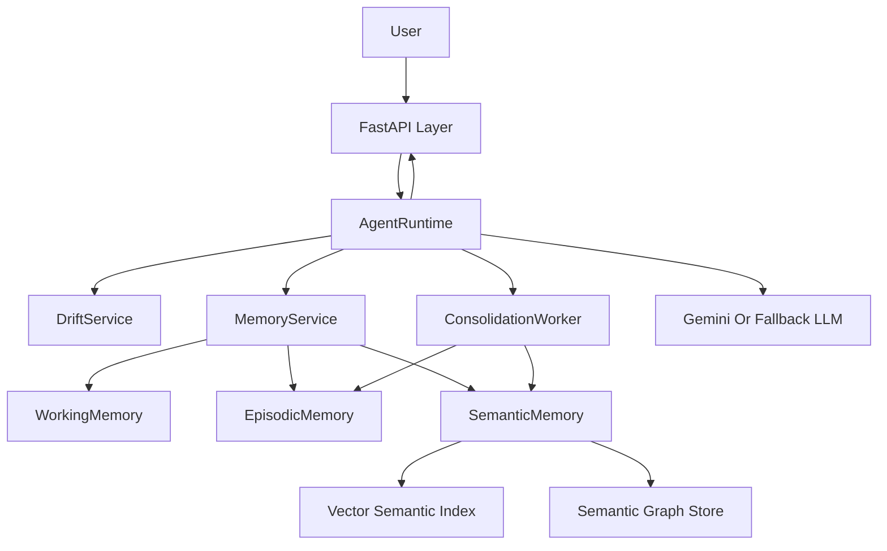
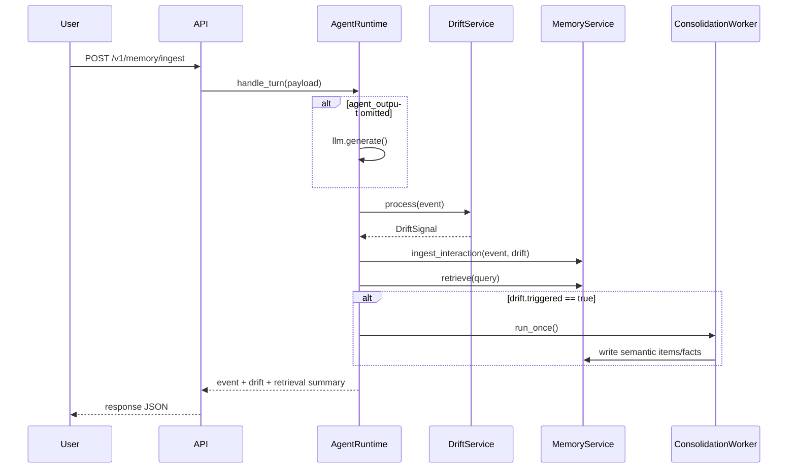
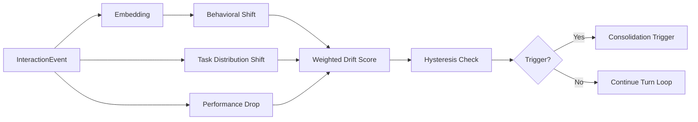
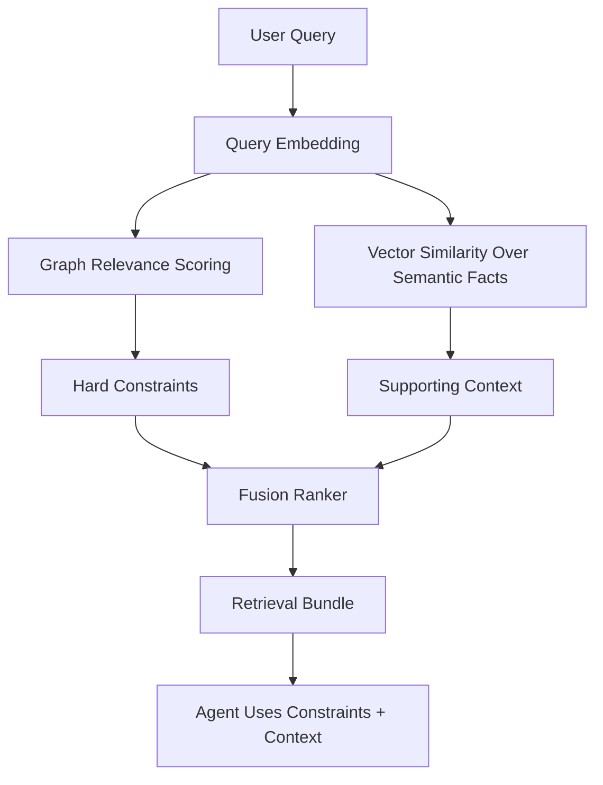
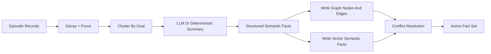
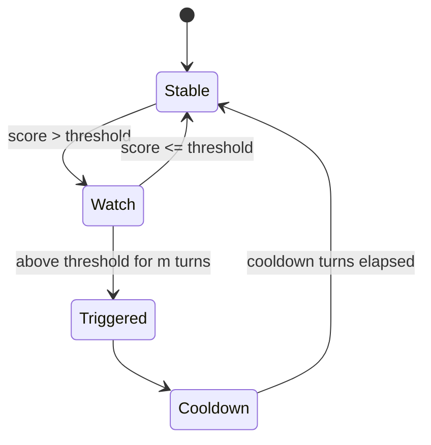
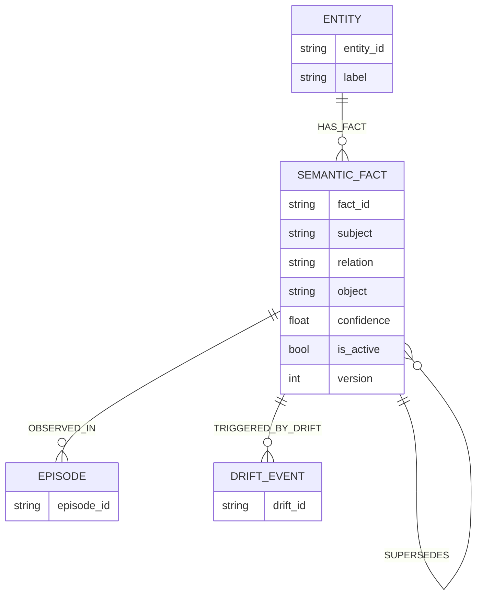
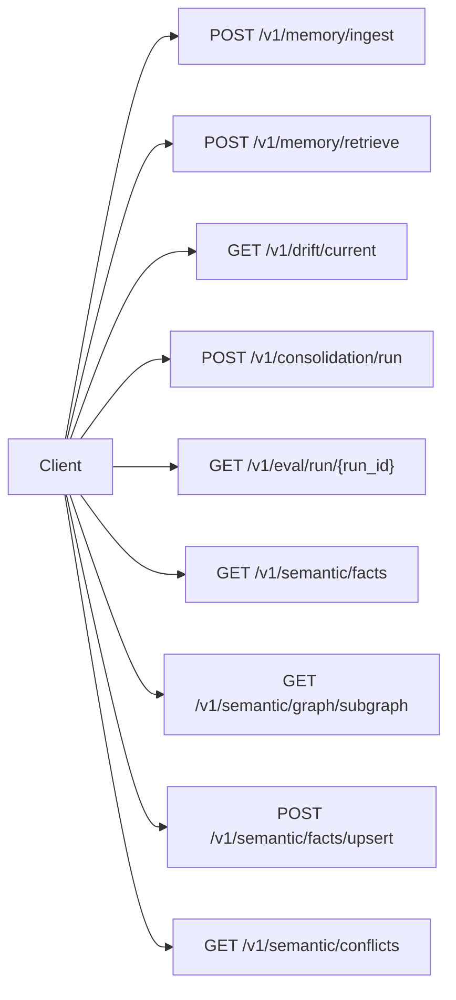
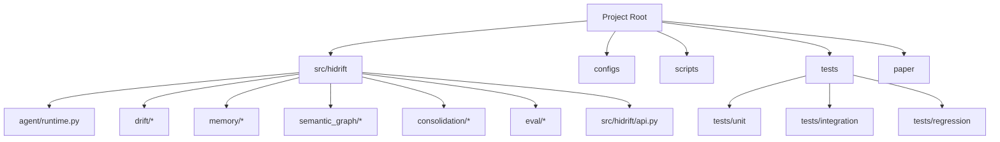

# HiDrift Architecture And Flow Diagrams

## 1. High-Level System

## 2. Request Lifecycle (Ingest)

## 3. Drift Detection Internals

## 4. Hybrid Retrieval Pipeline

## 5. Semantic Fact Consolidation Path

## 6. Drift Trigger State Machine

## 7. Semantic Graph Entity Model

## 8. API Surface Map

## 9. Evaluation And Reporting Flow

```mermaid
flowchart TB
    MatrixScript[run_eval_matrix.py] --> EvalScript[run_eval.py]
    EvalScript --> Suite[Benchmark Suite]
    Suite --> B1[personal_assistant_drift]
    Suite --> B2[tool_api_drift]
    Suite --> B3[contradiction_drift]
    Suite --> B4[semi_real_trace]
    Suite --> B5[locomo_like_trace]
    Suite --> B6[longmem_like_trace]
    B1 --> EvalArtifact["artifacts/eval_RUN_ID.json"]
    B2 --> EvalArtifact
    B3 --> EvalArtifact
    B4 --> EvalArtifact
    B5 --> EvalArtifact
    B6 --> EvalArtifact
    MatrixScript --> MatrixArtifact["artifacts/eval_matrix_MATRIX_ID.json"]
    EvalArtifact --> Sig[Significance Analysis]
    EvalArtifact --> ExportScript[export_figures.py]
    EvalArtifact --> BenchCheck[check_benchmark_registry.py]
    EvalArtifact --> PubCheck[check_publication_readiness.py]
    Sig --> T1[paper/tables/significance_report.md]
    BenchCheck --> T0[paper/tables/benchmark_registry_check.md]
    PubCheck --> TP[paper/tables/publication_readiness.md]
    ExportScript --> T2[paper/tables/aggregate_metrics.md]
    ExportScript --> T3[paper/tables/scenario_metrics.md]
    ExportScript --> T4[paper/tables/hypothesis_results.md]
    ExportScript --> T5[paper/tables/cost_latency_table.md]
    ExportScript --> T6[paper/tables/qualitative_failure_cases.md]
    ExportScript --> F1[paper/figures/task_success_with_errorbars.png]
    ExportScript --> F2[paper/figures/adaptation_latency_distribution.png]
    ExportScript --> F3[paper/figures/scenario_success_heatmap.png]
    ExportScript --> F4[paper/figures/drift_score_trace.png]
    ExportScript --> F5[paper/figures/memory_growth_trace.png]
    ExportScript --> F6[paper/figures/constraint_violation_trend.png]
```

## 10. Developer Navigation Map

