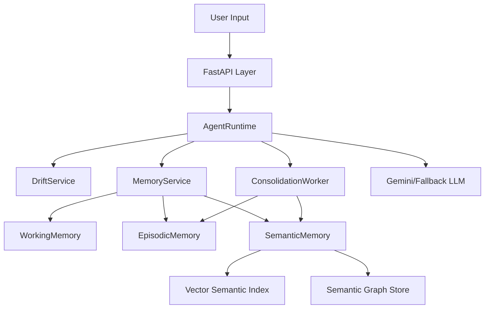
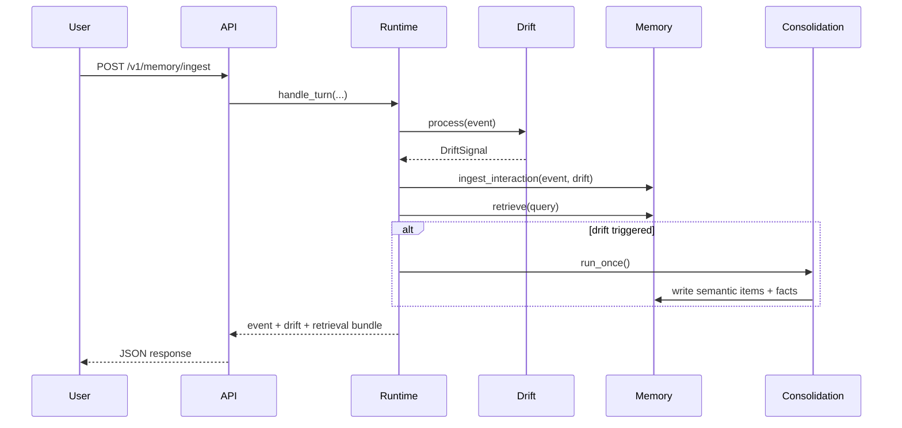
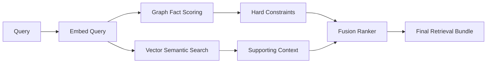
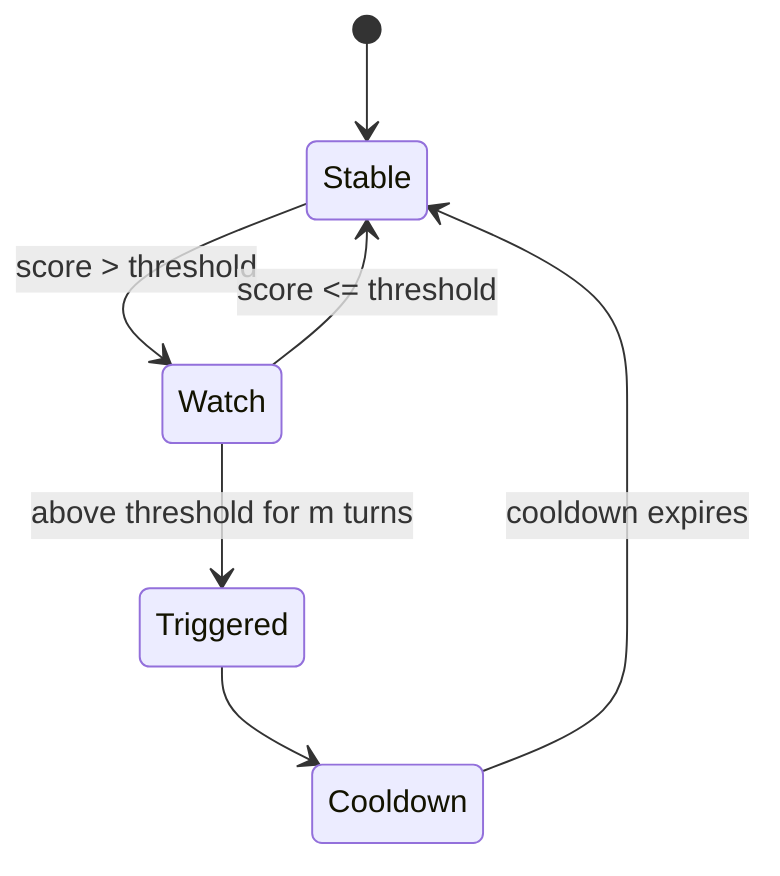
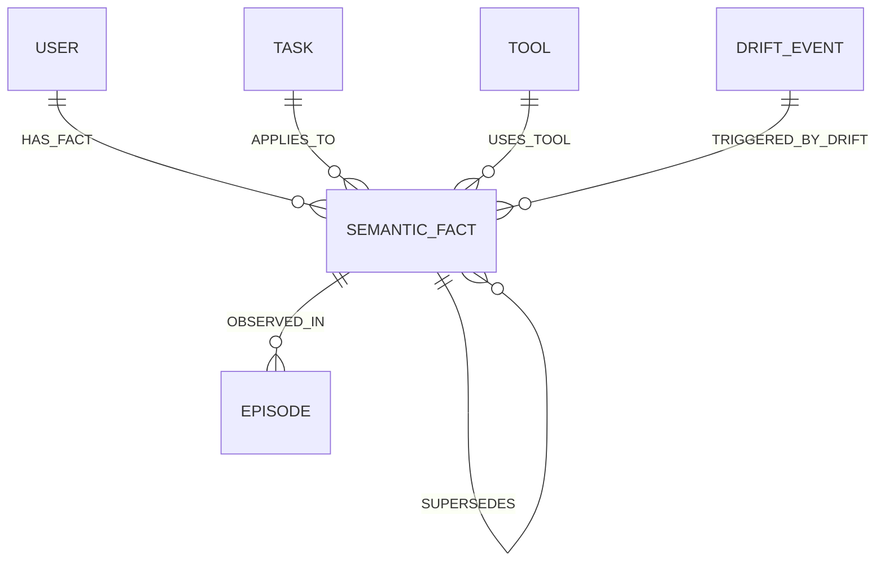
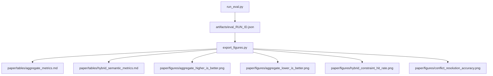

# HiDrift Architecture

## System Architecture

```mermaid
graph TD
    U[User Input] --> API[FastAPI Layer]
    API --> RT[AgentRuntime]
    RT --> DS[DriftService]
    RT --> MS[MemoryService]
    MS --> WM[WorkingMemory]
    MS --> EM[EpisodicMemory]
    MS --> SM[SemanticMemory]
    SM --> VS[Vector Semantic Index]
    SM --> GS[Semantic Graph Store]
    RT --> CW[ConsolidationWorker]
    CW --> EM
    CW --> SM
    RT --> LLM[Gemini/Fallback LLM]
```

## Turn Lifecycle

```mermaid
sequenceDiagram
    participant User
    participant API
    participant Runtime
    participant Drift
    participant Memory
    participant Consolidation
    User->>API: POST /v1/memory/ingest
    API->>Runtime: handle_turn(...)
    Runtime->>Drift: process(event)
    Drift-->>Runtime: DriftSignal
    Runtime->>Memory: ingest_interaction(event, drift)
    Runtime->>Memory: retrieve(query)
    alt drift triggered
      Runtime->>Consolidation: run_once()
      Consolidation->>Memory: write semantic items + facts
    end
    Runtime-->>API: event + drift + retrieval bundle
    API-->>User: JSON response
```

## Hybrid Retrieval Flow

```mermaid
flowchart LR
    Q[Query] --> E[Embed Query]
    E --> V[Vector Semantic Search]
    E --> G[Graph Fact Scoring]
    G --> HC[Hard Constraints]
    V --> SC[Supporting Context]
    HC --> F[Fusion Ranker]
    SC --> F
    F --> R[Final Retrieval Bundle]
```

## Drift Trigger State Machine

```mermaid
stateDiagram-v2
    [*] --> Stable
    Stable --> Watch: score > threshold
    Watch --> Stable: score <= threshold
    Watch --> Triggered: above threshold for m turns
    Triggered --> Cooldown
    Cooldown --> Stable: cooldown expires
```

## Semantic Graph ER Model

```mermaid
erDiagram
    USER ||--o{ SEMANTIC_FACT : HAS_FACT
    TASK ||--o{ SEMANTIC_FACT : APPLIES_TO
    TOOL ||--o{ SEMANTIC_FACT : USES_TOOL
    SEMANTIC_FACT ||--o{ EPISODE : OBSERVED_IN
    SEMANTIC_FACT ||--o{ SEMANTIC_FACT : SUPPORTS
    SEMANTIC_FACT ||--o{ SEMANTIC_FACT : CONTRADICTS
    SEMANTIC_FACT ||--o{ SEMANTIC_FACT : SUPERSEDES
    DRIFT_EVENT ||--o{ SEMANTIC_FACT : TRIGGERED_BY_DRIFT
```

## Evaluation + Visualization Flow

```mermaid
flowchart TB
    A[run_eval.py] --> B["artifacts/eval_RUN_ID.json"]
    B --> C[export_figures.py]
    C --> D[paper/tables/aggregate_metrics.md]
    C --> E[paper/tables/hybrid_semantic_metrics.md]
    C --> F[paper/figures/aggregate_higher_is_better.png]
    C --> G[paper/figures/aggregate_lower_is_better.png]
    C --> H[paper/figures/hybrid_constraint_hit_rate.png]
    C --> I[paper/figures/conflict_resolution_accuracy.png]
```
