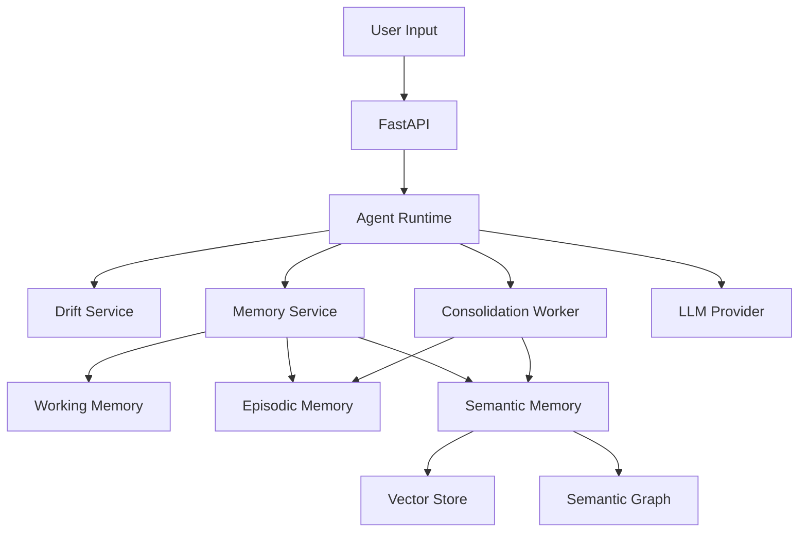
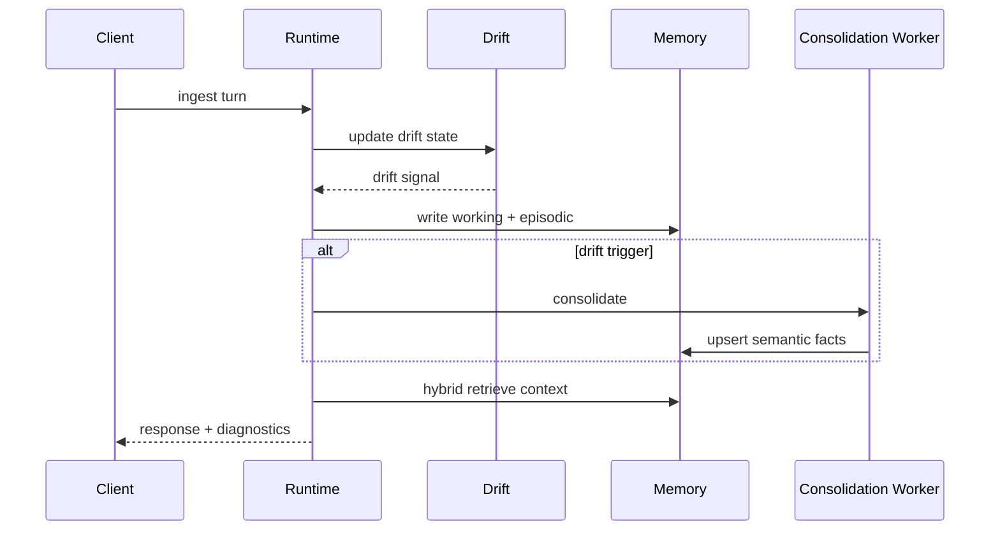
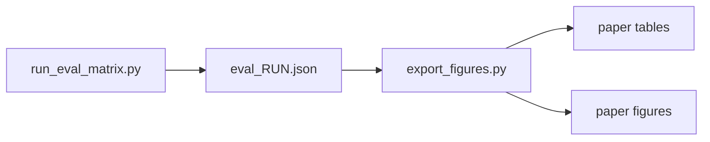

# HiDrift


Drift-aware hierarchical memory for long-horizon LLM agents, with hybrid semantic retrieval (graph + vector), consolidation, and reproducible evaluation.

`Tags:` `long-horizon-agents` `drift-detection` `hierarchical-memory` `semantic-graph` `continual-learning` `evaluation`

## Table Of Contents
1. Overview
2. System Architecture
3. Core Features
4. Repository Structure
5. Quick Start
6. Runtime API
7. Evaluation And Reporting
8. Reproducibility
9. Operational Notes
10. References

## 1. Overview
HiDrift focuses on memory degradation and adaptation failures in long-running assistants.

It provides:
1. Online drift scoring from behavioral, task, and performance signals.
2. Three-level memory hierarchy: working, episodic, semantic.
3. Consolidation from episodic traces into structured semantic facts.
4. Conflict-aware semantic graph updates and hybrid retrieval.
5. Benchmark matrix execution with statistical reporting and figures.

## 2. System Architecture
### 2.1 High-Level Runtime


### 2.2 Turn Lifecycle


### 2.3 Evaluation Pipeline


For full diagrams, see [ARCHITECTURE.md](ARCHITECTURE.md).

## 3. Core Features
1. Drift-aware triggering with threshold, hysteresis, and cooldown.
2. Hybrid semantic memory with active/inactive fact lifecycle.
3. Conflict resolution over `(subject, relation)` groups.
4. Evidence linking from semantic facts back to episodes.
5. Official benchmark data preparation and matrix execution tooling.

## 4. Repository Structure
1. `src/hidrift/agent/`: runtime orchestration.
2. `src/hidrift/drift/`: drift features and scoring.
3. `src/hidrift/memory/`: working, episodic, semantic layers.
4. `src/hidrift/semantic_graph/`: graph backend and reasoning.
5. `src/hidrift/consolidation/`: clustering and summarization.
6. `src/hidrift/eval/`: simulator, baselines, runner, stats.
7. `src/hidrift/api.py`: API entrypoint.
8. `configs/`: model, memory, drift, evaluation configs.
9. `scripts/`: eval, figures, calibration, data prep utilities.
10. `tests/`: unit, integration, regression coverage.
11. `paper/`: generated tables and figures.

## 5. Quick Start
### 5.1 Environment Setup
```powershell
python -m venv venv
.\venv\Scripts\Activate.ps1
python -m pip install --upgrade pip
pip install -e ".[dev,api]"
```

### 5.2 Gemini Setup
```env
GEMINI_API_KEY=your_real_key
HIDRIFT_LLM_PROVIDER=gemini
HIDRIFT_LLM_MODEL=gemini-2.5-flash
```

Connectivity check:
```powershell
python scripts/check_gemini.py
```

### 5.3 Run API
```powershell
uvicorn hidrift.api:create_app --factory --reload
```

Endpoints:
1. Swagger: `http://127.0.0.1:8000/docs`
2. OpenAPI: `http://127.0.0.1:8000/openapi.json`

## 6. Runtime API
### 6.1 Core Endpoints
1. `POST /v1/memory/ingest`
2. `POST /v1/memory/retrieve`
3. `GET /v1/drift/current`
4. `POST /v1/consolidation/run`
5. `GET /v1/eval/run/{run_id}`

### 6.2 Semantic Endpoints
1. `GET /v1/semantic/facts`
2. `GET /v1/semantic/graph/subgraph`
3. `POST /v1/semantic/facts/upsert`
4. `GET /v1/semantic/conflicts`

## 7. Evaluation And Reporting
### 7.1 Main Benchmark Matrix
```powershell
python scripts/run_eval_matrix.py --config configs/eval/matrix_main.json
python scripts/export_figures.py
```

### 7.2 Official Benchmark Flow
```powershell
python scripts/prepare_official_benchmarks.py
make eval_official
python scripts/export_figures.py
```

### 7.3 Testing
```powershell
pytest -q
pytest -v --durations=10
```

### 7.4 Primary Outputs
1. `artifacts/eval_<run_id>.json`
2. `artifacts/eval_matrix_<matrix_id>.json`
3. `paper/tables/aggregate_metrics.md`
4. `paper/tables/significance_report.md`
5. `paper/figures/task_success_with_errorbars.png`
6. `paper/figures/scenario_success_heatmap.png`

## 8. Reproducibility
Recommended execution order:
1. `pytest -q`
2. `python scripts/prepare_official_benchmarks.py`
3. `python scripts/run_eval_matrix.py --config configs/eval/matrix_main.json`
4. `python scripts/export_figures.py`
5. Archive `artifacts/` + `paper/tables` + `paper/figures`.

Detailed technical docs:
1. [DOCUMENTATION.md](DOCUMENTATION.md)
2. [TESTING.md](TESTING.md)
3. [PRESENTATION_BRIEF.md](PRESENTATION_BRIEF.md)

## 9. Operational Notes
1. API runtime defaults to Gemini.
2. Evaluation defaults to fallback model for deterministic local runs.
3. Semantic graph persistence is local file-based (`artifacts/semantic_graph.json`).
4. Current graph backend is `networkx` (single-process).

## 10. References
1. Park et al., Generative Agents, UIST 2023. https://arxiv.org/abs/2304.03442
2. Wang et al., Voyager, arXiv 2023. https://arxiv.org/abs/2305.16291
3. Packer et al., MemGPT, arXiv 2023. https://arxiv.org/abs/2310.08560
4. Zhang et al., LoCoMo, ACL 2024. https://aclanthology.org/2024.acl-long.747/
5. LongMemEval benchmark repository. https://github.com/xiaowu0162/LongMemEval
