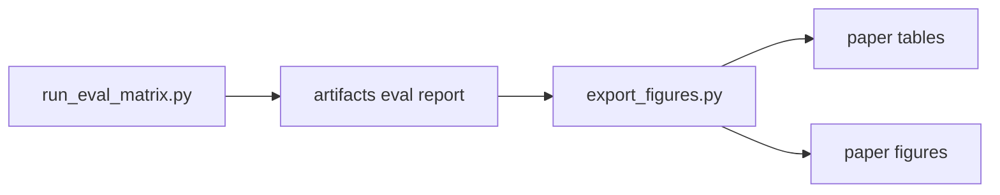
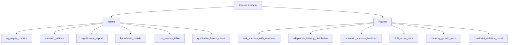
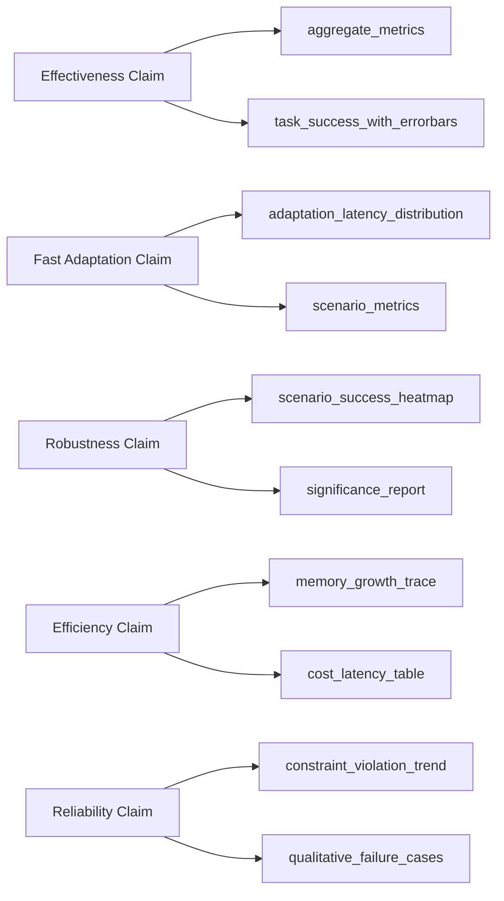

# Results Interpretation Guide

## Purpose
This guide explains each generated table and figure in `paper/tables` and `paper/figures`, how to interpret it, and how to present it in reports/slides.

## 0. Artifact Map (Mermaid)
### 0.1 Generation Flow


### 0.2 Table And Figure Taxonomy


### 0.3 Claim To Evidence Mapping


## 1. Tables

### 1.1 `aggregate_metrics.md`
What it is:
1. Main system-level summary over all benchmark scenarios and seeds.

How to read:
1. Compare `HiDrift-full` against baselines on `task_success_rate`, `adaptation_latency`, and `memory_bloat`.
2. Higher is better for success/retrieval/stability.
3. Lower is better for latency/hallucination/constraint violations/bloat.

Use in presentation:
1. Primary quantitative comparison table.

### 1.2 `aggregate_metrics.json`
What it is:
1. Machine-readable version of aggregate results.

How to read:
1. Use for script-based checks and custom plotting.

Use in presentation:
1. Not shown directly; source for reproducible regeneration.

### 1.3 `scenario_metrics.md`
What it is:
1. Per-scenario system metrics (drift families split out).

How to read:
1. Identify where HiDrift helps most (for example tool/schema drift vs contradiction drift).
2. Check robustness, not only average performance.

Use in presentation:
1. Add one slide for scenario-wise generalization.

### 1.4 `significance_report.md`
What it is:
1. Statistical comparison vs reference system (`HiDrift-full`) with p-values and effect sizes.

How to read:
1. Focus on adjusted p-values (`p_value_holm`) and effect size direction/magnitude.
2. Significant + practical effect supports strong empirical claims.

Use in presentation:
1. Evidence slide for statistical rigor.

### 1.5 `hypothesis_results.md`
What it is:
1. Boolean outcomes for predefined hypotheses (module contributions/ablations).

How to read:
1. `true` indicates hypothesis supported by aggregated run outputs.

Use in presentation:
1. Ablation conclusion slide.

### 1.6 `cost_latency_table.md`
What it is:
1. Efficiency summary (latency + consolidation behavior).

How to read:
1. Compare quality gains against runtime overhead and consolidation frequency.

Use in presentation:
1. Practicality/engineering trade-off slide.

### 1.7 `qualitative_failure_cases.md`
What it is:
1. Selected failure traces with drift context and expected behavior.

How to read:
1. Review recurring failure patterns (style misses, constraint misses, delayed adaptation).

Use in presentation:
1. Error analysis slide.

### 1.8 `hybrid_semantic_metrics.md`
What it is:
1. Legacy hybrid-memory specific summary table.

How to read:
1. Use only if referenced by your current experiment script output.

Use in presentation:
1. Optional appendix slide.

### 1.9 `benchmark_registry_check.*`, `publication_readiness.*`, `iccv_*`
What it is:
1. Automated quality/readiness gate artifacts from policy scripts.

How to read:
1. `PASS` means gate criteria satisfied for that run/report.
2. `FAIL` rows indicate exactly which criteria were not met.

Use in presentation:
1. Appendix/reproducibility slide to show compliance process.

## 2. Figures

### 2.1 `task_success_with_errorbars.png`
What it shows:
1. Mean task success per system with seed variance.

Interpretation:
1. Higher bars are better.
2. Smaller error bars indicate stable performance.

Primary claim supported:
1. Overall effectiveness and consistency.

### 2.2 `adaptation_latency_distribution.png`
What it shows:
1. Distribution of turns required to recover after drift.

Interpretation:
1. Lower values are better.
2. Left-shifted distributions indicate faster adaptation.

Primary claim supported:
1. Drift recovery speed advantage.

### 2.3 `scenario_success_heatmap.png`
What it shows:
1. Success by system (columns) and scenario (rows).

Interpretation:
1. Look for broad, dark/high-performance coverage rather than one-scenario wins.

Primary claim supported:
1. Cross-scenario robustness.

### 2.4 `drift_score_trace.png`
What it shows:
1. Drift score over turns for selected traces.

Interpretation:
1. Peaks should align with known drift events.
2. Useful for validating drift detector sensitivity.

Primary claim supported:
1. Drift signal quality and temporal responsiveness.

### 2.5 `memory_growth_trace.png`
What it shows:
1. Memory footprint over time.

Interpretation:
1. Controlled growth/plateau indicates good consolidation and pruning.
2. Steep unchecked growth indicates memory bloat risk.

Primary claim supported:
1. Long-horizon memory efficiency.

### 2.6 `constraint_violation_trend.png`
What it shows:
1. Constraint violation behavior across turns.

Interpretation:
1. Lower trend indicates better safety/constraint adherence.

Primary claim supported:
1. Reliability under long-horizon drift.

### 2.7 Legacy figures (`aggregate_higher_is_better.png`, `aggregate_lower_is_better.png`, `hybrid_constraint_hit_rate.png`, `conflict_resolution_accuracy.png`, `drift_trigger_timeline.png`, `consolidation_event_count.png`)
What they are:
1. Earlier/auxiliary visualizations from prior export stages.

How to use:
1. Keep in appendix unless directly referenced by current result narrative.
2. Prefer the current core figure set above for main slides.

## 3. Recommended Slide Mapping
1. Main results: `aggregate_metrics.md` + `task_success_with_errorbars.png`
2. Adaptation claim: `adaptation_latency_distribution.png`
3. Robustness: `scenario_success_heatmap.png`
4. Memory efficiency: `memory_growth_trace.png`
5. Reliability: `constraint_violation_trend.png`
6. Statistics: `significance_report.md`
7. Error analysis: `qualitative_failure_cases.md`

## 4. Reproducibility Commands
```powershell
python scripts/prepare_official_benchmarks.py
python scripts/run_eval_matrix.py --config configs/eval/matrix_main.json
python scripts/export_figures.py
```

If official benchmark mode is required:
```powershell
make eval_official
python scripts/export_figures.py
```
